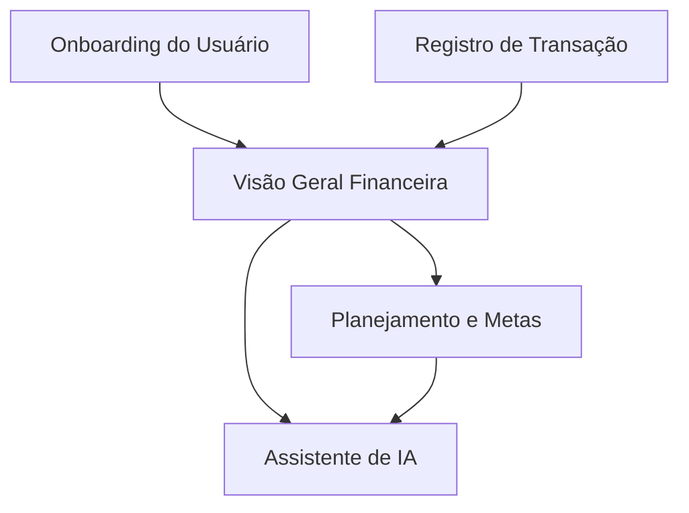

# FidesMoney

> FidesMoney é um aplicativo brasileiro de finanças pessoais focado em registro manual de transações (receitas, despesas, transferências) para aumentar a consciência financeira do usuário. Ele oferece planejamento baseado na regra 50-30-20, acompanhamento de metas e um assistente de IA para insights sobre os próprios dados do usuário. O app se diferencia por ser nativo para iPhone e por uma abordagem transparente sem projeções enganosas, atualmente em fase de lançamento para um grupo seleto.

---

## Avaliação de Viabilidade

**Nota Geral:** 64/100

### Pilares

| Pilar | Nota | Análise |
|-------|------|---------|
| Fit Problema-Solução | 75/10 | O problema de organização financeira é real e doloroso para muitos, e a abordagem de lançamento manual foca na consciência, mas pode gerar alta fricção para o usuário a longo prazo. |
| Demanda de Mercado | 65/10 | Existe uma demanda clara por organização financeira no público-alvo, mas o mercado é extremamente concorrido com soluções estabelecidas, exigindo um esforço significativo para capturar atenção. |
| Viabilidade Técnica | 85/10 | A solução, focada em registro manual e sem integração bancária inicial, é tecnicamente viável para uma equipe pequena, mesmo com o assistente de IA focado nos dados do usuário. |
| Potencial de Monetização | 60/10 | Há potencial de monetização via preço único e futuro plano mensal, mas o mercado é sensível a custos e muitos concorrentes oferecem funcionalidades básicas gratuitas. |
| Go-to-Market | 45/10 | O plano de go-to-market atual é vago, com dependência inicial de rede pessoal e sem canais de aquisição escaláveis definidos para o público-alvo. |
| Defensibilidade | 40/10 | O diferencial de ser 'built for iPhone' ou focar em 'insights' é replicável; o registro manual é uma escolha de produto, mas não cria uma barreira de entrada forte contra concorrentes estabelecidos. |

---

## Como melhorar sua nota

- Pesquisar e validar a disposição de pagar por apps de finanças pessoais via testes A/B de pricing → sobe monetization_potential de 60 para ~75.
- Desenvolver e testar canais de aquisição de usuários (ex: ASO, campanhas de conteúdo, parcerias) para alcançar o público-alvo → sobe go_to_market de 45 para ~70.
- Explorar diferenciais não-replicáveis, como uma comunidade exclusiva ou parcerias estratégicas com educadores financeiros → sobe defensibility de 40 para ~60.
- Oferecer um teste gratuito com onboarding guiado para mitigar a fricção inicial do registro manual e demonstrar o valor rapidamente → sobe problem_solution_fit de 75 para ~85.

---

## Análise de Risco

**Maior risco:** O maior risco é a baixa adesão e alta rotatividade de usuários devido à fricção do registro manual em um mercado com muitas alternativas gratuitas e automatizadas.

**Premissas-chave:**
- Usuários estarão dispostos a registrar consistentemente todas as transações financeiras manualmente.
- O valor gerado pelos insights e planejamento do FidesMoney é suficiente para justificar o esforço manual e o custo de assinatura.
- O nicho de usuários que valorizam o registro manual para consciência financeira é grande o suficiente para sustentar o negócio.

---

## Funcionalidades

### Core
- Registro manual de receitas, despesas e transferências com categorias e status (pago/pendente).
- Gestão de contas e cartões com cálculo de saldo real e distinção entre valores pagos e pendentes.
- Planejamento financeiro 50-30-20 com limites por categoria, visualização de consumo e insights de destaque mensais.
- Acompanhamento de metas financeiras com progresso visual.
- Assistente com IA para responder perguntas sobre os dados financeiros do próprio usuário.

### Melhorias Sugeridas
- Realizar entrevistas aprofundadas com 20-30 potenciais usuários para entender a real motivação e a sustentabilidade do hábito de registro manual.
- Desenvolver um plano de marketing e aquisição de usuários com canais definidos, como ASO e marketing de conteúdo, para escalar além da rede inicial.
- Testar diferentes modelos de precificação e propostas de valor com grupos de usuários para otimizar a conversão e o ARPU.
- Explorar a inclusão de micro-incentivos ou gamificação para aumentar a consistência do registro manual e a retenção.

**Justificativa:** Estas features cobrem o ciclo completo de controle financeiro proposto: o registro manual é a base para a consciência, a gestão de contas garante a acurácia, o planejamento e as metas direcionam o futuro, e o assistente de IA extrai valor dos dados inseridos, alinhando-se com o diferencial de 'insights' sobre 'apenas registrar'.

---

## Stack Tecnológica

**Nível de expertise:** Avançado

**Tecnologias:**
- Swift
- SwiftUI
- Core Data
- Firebase/Supabase (Auth, Database, Functions)
- ChatGPT API (ou similar para AI)

**Justificativa:** A escolha de Swift/SwiftUI para desenvolvimento nativo no iPhone garante uma experiência de usuário e performance superiores, alinhada ao diferencial do produto. Core Data oferece persistência eficiente no dispositivo, enquanto Firebase/Supabase provê uma solução backend escalável e gerenciável para autenticação, sincronização de dados e funções serverless, além da integração com APIs de IA para o assistente.

---

## Planos de Preço

### Fides Gratuito — R$ 0/único

> Comece a organizar suas finanças sem custo.

**Métrica de valor:** Contas e categorias

**Inclui:**
- Registro manual de transações
- Visualização básica de despesas
- Limite de 1 conta e 5 categorias

### Fides Essencial — R$ 89.9/único ⭐ Recomendado

> Controle completo para uma vida financeira saudável.

**Métrica de valor:** Planejamento e metas

**Inclui:**
- Todas as funcionalidades do Gratuito
- Contas e categorias ilimitadas
- Planejamento 50-30-20 e insights
- Acompanhamento de metas (até 3)
- Relatórios básicos

### Fides Premium — R$ 149.9/único

> Seu consultor financeiro pessoal com IA.

**Métrica de valor:** Inteligência e suporte

**Inclui:**
- Todas as funcionalidades do Essencial
- Acompanhamento de metas ilimitadas
- Assistente de IA ilimitado para seus dados
- Relatórios avançados e exportação
- Suporte prioritário

**Justificativa:** O modelo de precificação inicial de preço único atende à intenção do fundador e facilita a aquisição em um mercado sensível a assinaturas. Os tiers são baseados na profundidade das funcionalidades e no nível de insights/inteligência, com o plano Essencial como ponto de entrada de valor. O plano gratuito serve como isca para conscientização, enquanto o Premium adiciona valor através da IA e suporte, pavimentando o caminho para um futuro modelo de assinatura mensal.

---

## Fluxo do Produto

### Onboarding do Usuário

Processo inicial de cadastro e configuração básica.

- ✅ Cadastro de conta e perfil *(feito)*
- 🔄 Explicação do modelo de registro manual *(em andamento)*
- ⏳ Configuração inicial de categorias e limites (opcional) *(pendente)*

### Registro de Transação

Adicionar despesas, receitas e transferências.

- ✅ Formulário de nova transação (valor, categoria, data, status) *(feito)*
- ✅ Seleção da conta/cartão *(feito)*
- 🔄 Adição de tags/observações *(em andamento)*

### Visão Geral Financeira

Dashboard com o panorama atual e futuro das finanças.

- ✅ Saldo consolidado (pago vs. pendente) *(feito)*
- ✅ Gráficos de despesas por categoria *(feito)*
- 🔄 Projeção de fluxo de caixa (baseada em transações futuras) *(em andamento)*

### Planejamento e Metas

Ferramentas para definir e acompanhar objetivos financeiros.

- ✅ Configuração de limites 50-30-20 e acompanhamento visual *(feito)*
- 🔄 Criação e acompanhamento de metas (reserva, viagem) *(em andamento)*
- ✅ Insights personalizados (maior gasto, o que subiu) *(feito)*

### Assistente de IA

Interação com IA para obter respostas sobre dados financeiros pessoais.

- 🔄 Interface de chat com IA *(em andamento)*
- ⏳ Capacidade de responder sobre gastos específicos *(pendente)*
- ⏳ Sugestões baseadas nos hábitos do usuário *(pendente)*

---

## Memory Bank

### Project Brief

FidesMoney é um aplicativo brasileiro de finanças pessoais focado em registro manual de transações, com planejamento 50-30-20, metas e IA, para usuários de 20-45 anos interessados em consciência financeira.

### Contexto do Produto

O produto visa resolver a desorganização financeira através da fricção intencional do registro manual, que gera maior consciência. Diferencia-se pela experiência nativa iOS e insights diretos, sem projeções enganosas. O estágio atual é de lançamento para amigos/família, com expansão planejada para importação de extratos e integração via WhatsApp.

### Padrões do Sistema

O app implementa padrões de gestão de orçamento pessoal, como categorias de despesas, acompanhamento de metas e a regra 50-30-20. O assistente de IA segue um padrão de interface conversacional para recuperação e análise de dados do usuário. O core é baseado em entrada manual, o que é um padrão de apps de finanças mais antigos ou para nichos específicos.

### Contexto Técnico

O projeto é 'built from scratch for iPhone', sugerindo uma base nativa iOS (Swift/SwiftUI). Não há integração bancária inicial, simplificando a complexidade de APIs externas e regulamentação. O assistente de IA sobre dados próprios do usuário sugere uma integração com LLMs locais ou APIs com forte foco em privacidade.

### Contexto Ativo

Avaliando a viabilidade de um app de finanças pessoais focado em registro manual e insights, com um plano de monetização inicial de preço único. O principal desafio é a concorrência e a fricção do registro manual em um mercado onde a automação é a norma. Foco em GTM e defensibilidade.

### Progresso

Análise de viabilidade inicial concluída, incluindo pontuações por pilar, riscos, suposições, melhorias, features, stack e planos de precificação. O fluxo de usuário foi mapeado. Próximo passo é refinar o plano de GTM e estratégias de diferenciação.

---

*Gerado por IdeIA em 28/06/2026, 01:28*